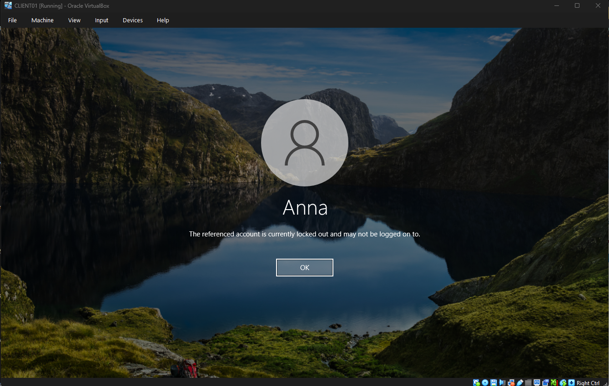
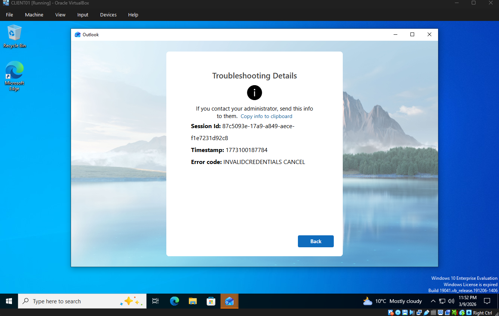
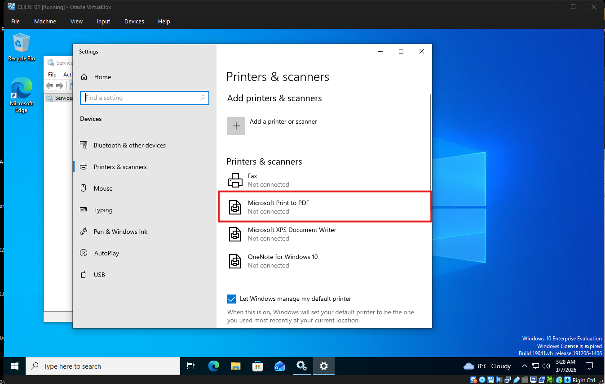
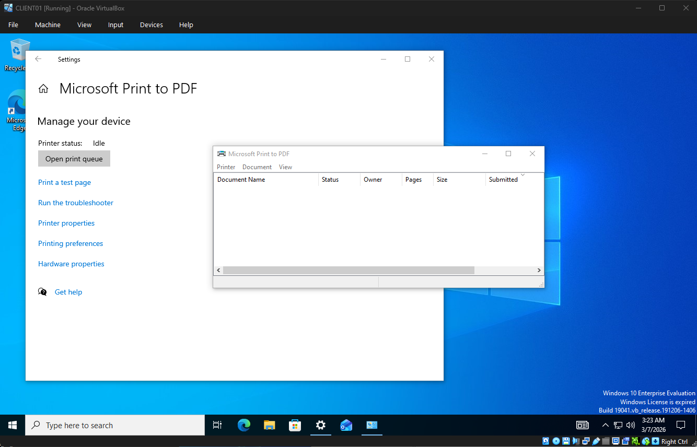
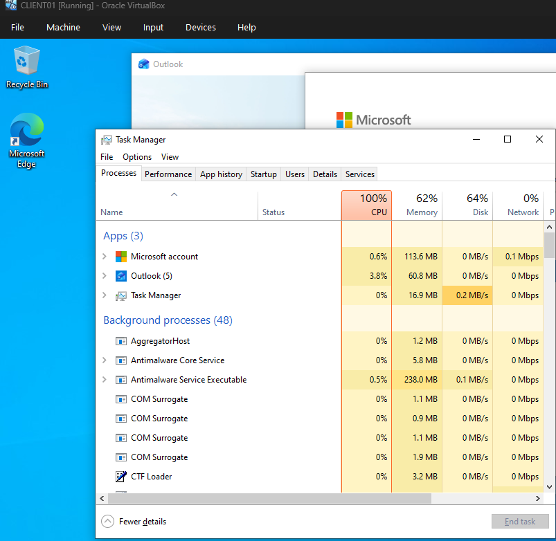

# Active Directory Administration Lab

## Overview

This project demonstrates system administration tasks using Microsoft Active Directory in a simulated corporate IT environment.

The lab replicates common tasks performed by IT Support and Help Desk technicians including:

- Active Directory user management
- Security group configuration
- Shared folder permissions
- Account lockout troubleshooting
- Email client troubleshooting
- Printer troubleshooting
- Workstation performance diagnostics

The objective is to simulate real-world support scenarios encountered by IT administrators.

---

# Lab Environment

- Windows Server 2025
- Active Directory Domain Services
- Windows 10 Client Machine
- Oracle VirtualBox virtual environment

Domain:

corp.local

---

# Objectives

The goal of this lab is to demonstrate practical experience with:

- Active Directory installation
- Organizational Unit (OU) management
- User account creation
- Security group management
- Shared folder permissions
- Account lockout troubleshooting
- Outlook configuration troubleshooting
- Printer service diagnostics
- Workstation performance troubleshooting

---

# Active Directory Installation

Active Directory Domain Services was installed on Windows Server 2025 and the server was promoted to a Domain Controller.

Screenshot:

---

# Organizational Unit Structure

Organizational Units were created to simulate departments within a company.

Departments created:

- HR
- IT
- Finance

Screenshot:

---

# User Account Creation

Users were created inside each departmental OU.

Example users:

- Anna (HR)
- John (IT)
- Michael (Finance)

Screenshot:

---

# Security Groups

Security groups were created to manage access permissions to shared resources.

Groups created:

- HR-Share
- IT-Share
- Finance-Share

Users were assigned to the appropriate group based on department.

Screenshot:

---

# Shared Folder Permissions

A shared network folder was created for the HR department.

Folder path:

C:\Shares\HR

Access permissions were assigned to the HR-Share security group.

Using security groups instead of individual users ensures easier access management in enterprise environments.

Screenshot:

---

# Account Lockout Troubleshooting

A user account was intentionally locked by entering the wrong password multiple times.

This simulates a common help desk support scenario.

The issue was resolved by unlocking the account through Active Directory Users and Computers.

Screenshot:

---

# Outlook Configuration Issue

A user reported that Microsoft Outlook could not configure the email account.

During setup, Outlook displayed an error message indicating an invalid email configuration.

Screenshot:

## Investigation

The Outlook configuration process was reviewed and the email address format was checked.

## Root Cause

An incorrect email address was entered during account configuration.

## Resolution

The email address was corrected and the Outlook setup process was restarted.

## Verification

Outlook configuration proceeded normally after correcting the email address.

---

# Printer Troubleshooting

A user reported that documents could not be printed and the printer appeared as **Not Connected**.

Screenshot:

## Investigation

The printer status was checked in:

Settings → Devices → Printers & Scanners

The Print Spooler service was inspected.

## Root Cause

The Print Spooler service was stopped.

## Resolution

The Print Spooler service was restarted using:

services.msc

Screenshot:

## Verification

Printing functionality was restored after restarting the service.

---

# Slow Workstation Performance

A user reported that their workstation was extremely slow and applications were taking a long time to open.

Screenshot:

## Investigation

System performance was analyzed using Task Manager.

High CPU usage and multiple startup applications were detected.

## Root Cause

Too many startup applications were consuming system resources.

## Resolution

Unnecessary startup programs were disabled and system cleanup was performed.

Screenshot:

## Verification

System performance improved and the workstation responded normally.

---

# Skills Demonstrated

This lab demonstrates practical IT Support skills including:

- Active Directory Administration
- User and Group Management
- Shared Folder Permission Configuration
- Account Lockout Troubleshooting
- Outlook Email Configuration Troubleshooting
- Printer Service Diagnostics
- Windows System Performance Analysis
- Help Desk Problem Investigation
