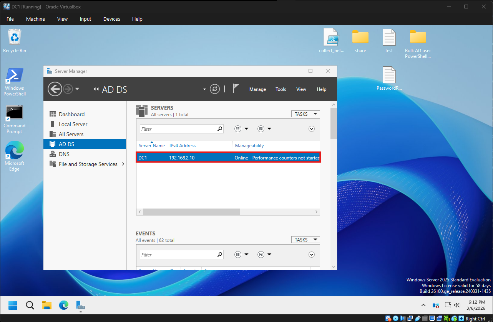
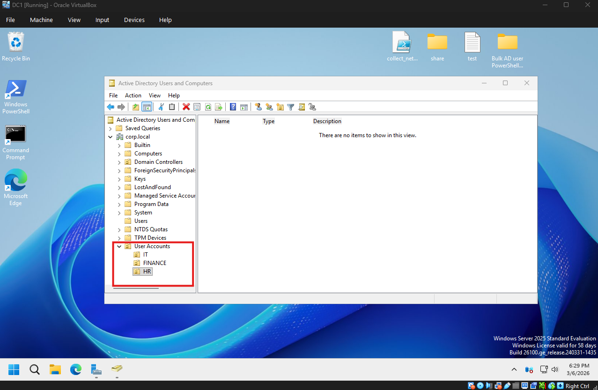
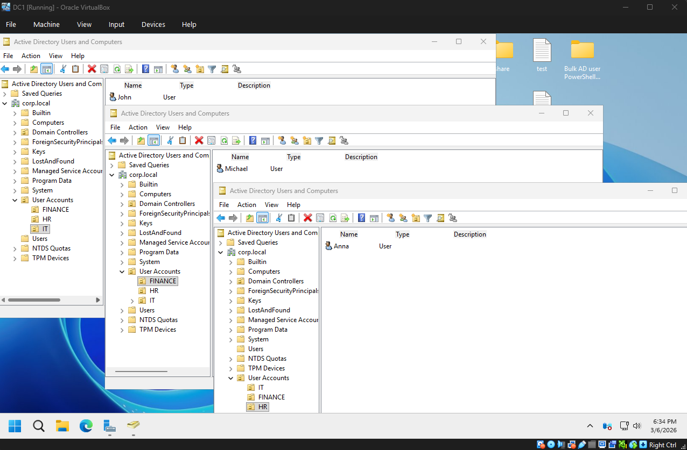
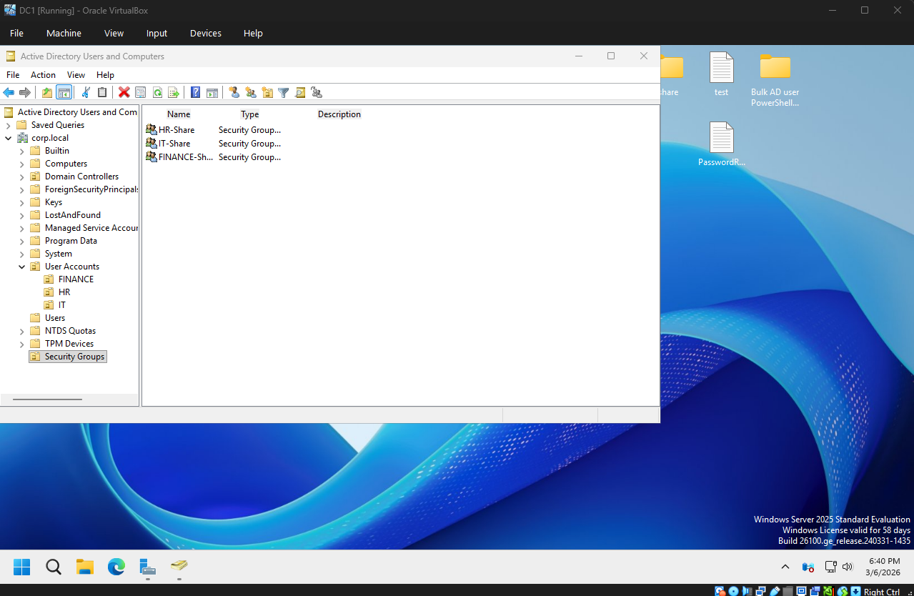
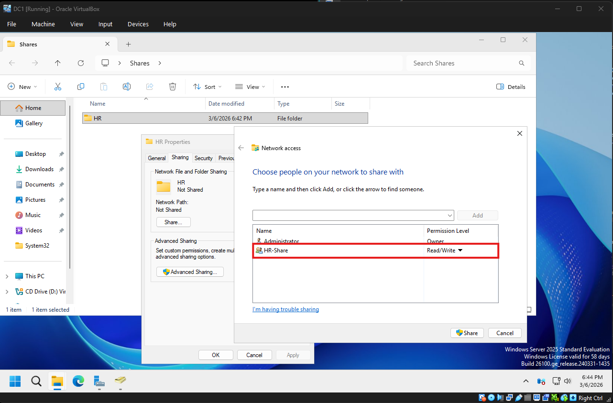

# Active Directory Administration Lab

## Overview

This project demonstrates basic system administration tasks using Microsoft Active Directory in a simulated corporate environment.
The lab replicates common tasks performed by IT Support and Help Desk technicians, including user management, group permissions, and troubleshooting account issues.

## Lab Environment

- Windows Server 2022
- Active Directory Domain Services
- Virtual Machine environment

Domain name:
'''
corp.local
'''

## Objectives

The goal of this lab is to demonstrate practical experience with:

- Active Directory installation
- Organizational Unit (OU) management
- User account creation
- Security group management
- Shared folder permissions
- Account lockout troubleshooting

## Active Directory Installation

Active Directory Domain Services was installed on Windows Server 2022 and the server was promoted to a Domain Controller.

Screenshot:

## Organizational Unit Structure

Organizational Units were created to simulate departments within a company.

Departments created:

- HR
- IT
- Finance

Screenshot:

## User Account Creation

Users were created inside each departmental OU.

Example users:

- Anna HR
- John IT
- Michael Finance

Screenshot:

## Security Groups

Security groups were created to manage access permissions.

Groups created:

- HR-Share
- IT-Share
- Finance-Share

Screenshot:

## Shared Folder Permissions

A shared network folder was created for the HR department.

Path:

\\corp.local\HR

Permissions were assigned to the HR-Share security group.

Screenshot:

## Account Lockout Troubleshooting

A user account was intentionally locked after multiple failed login attempts.

The issue was resolved by unlocking the account through Active Directory Users and Computers.

Screenshot:

## Skills Demonstrated

- Active Directory Administration
- User and Group Management
- File Share Permissions
- Help Desk Troubleshooting
- Windows Server Management
